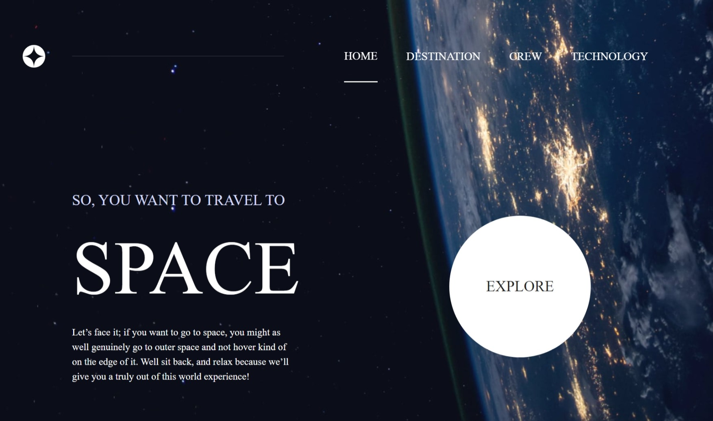
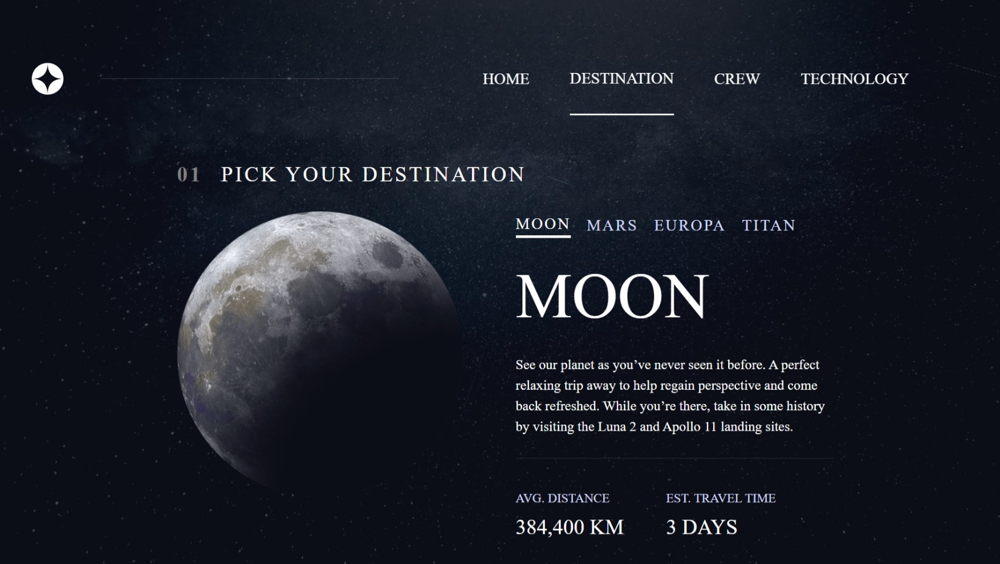
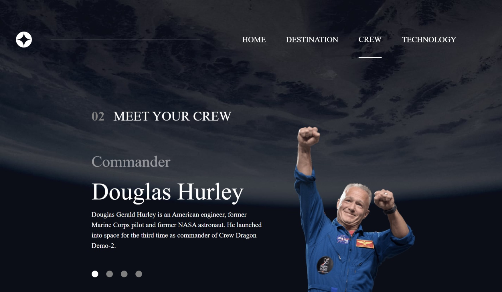
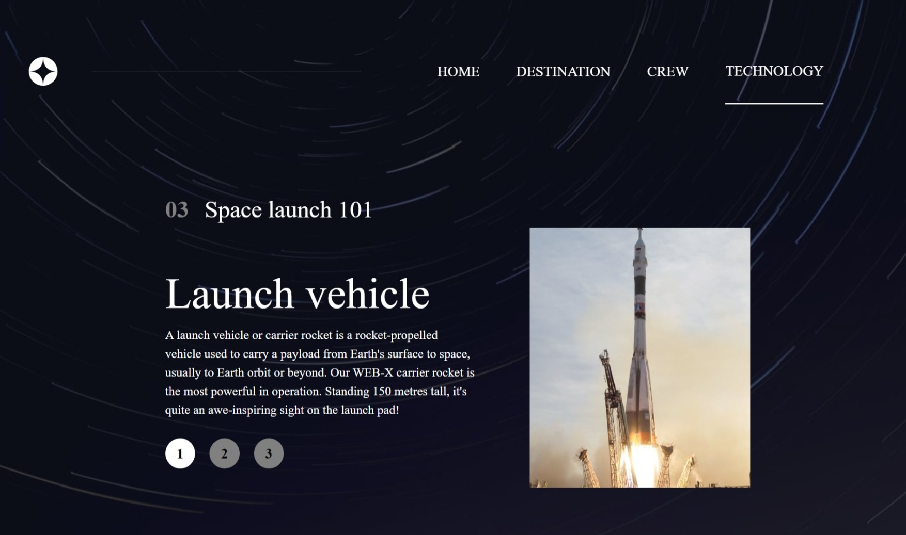
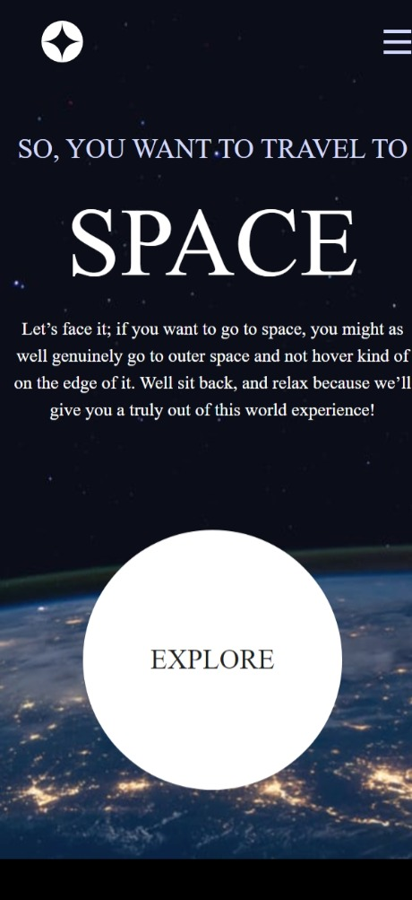
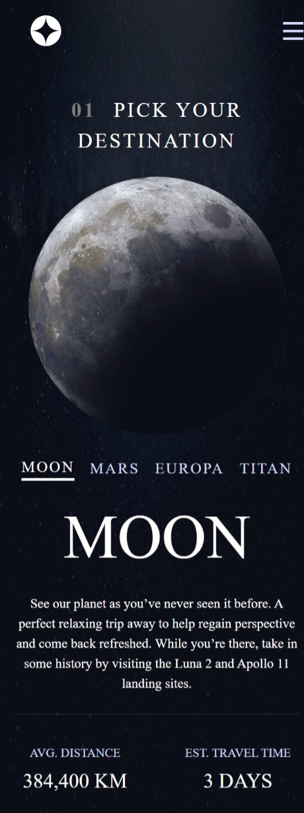
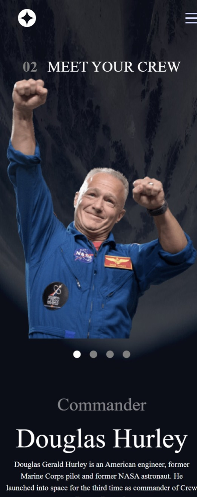
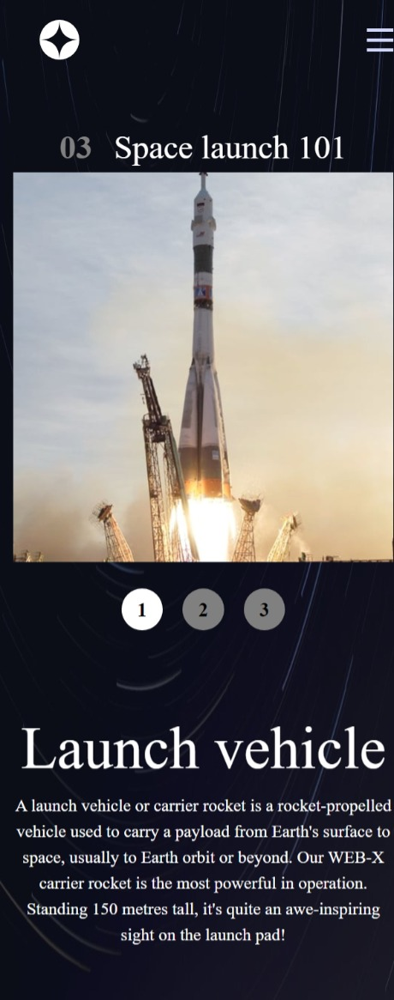
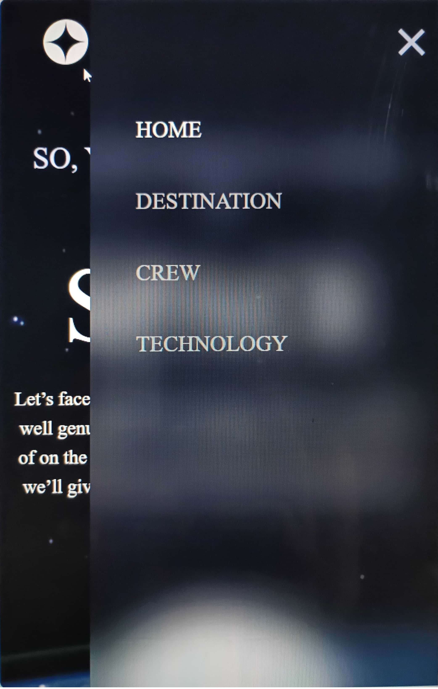

# Frontend Mentor - Space tourism website solution

This is a solution to the Space tourism website challenge on Frontend Mentor. Frontend Mentor challenges help you improve your coding skills by building realistic projects.

## Table of contents

- [Overview](#overview)
  - [The challenge](#the-challenge)
  - [Screenshot](#screenshots)
- [My process](#my-process)
  - [Built with](#built-with)
  - [What I learned](#what-i-learned)

## Overview

### The challenge

Users should be able to:

View the optimal layout for each of the website's pages depending on their device's screen size
See hover states for all interactive elements on the page
View each page and be able to toggle between the tabs to see new information

### Screenshots

## My process

### Built with

- Semantic HTML5 markup
- CSS custom properties
- Flexbox
- CSS Grid
- Desktop-first workflow
- [React](https://reactjs.org/) - JS library

### What I learned

This was a great challenge that taught me a lot about Routing in react.
